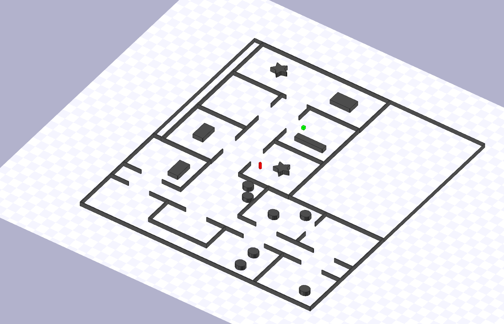
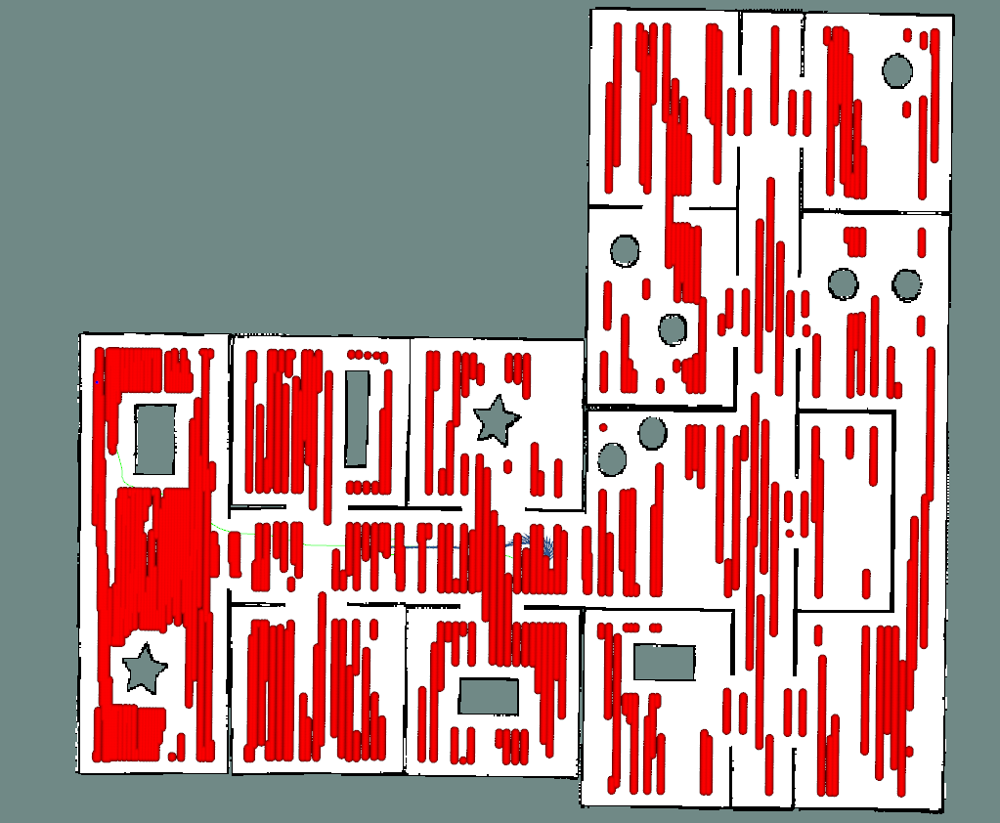
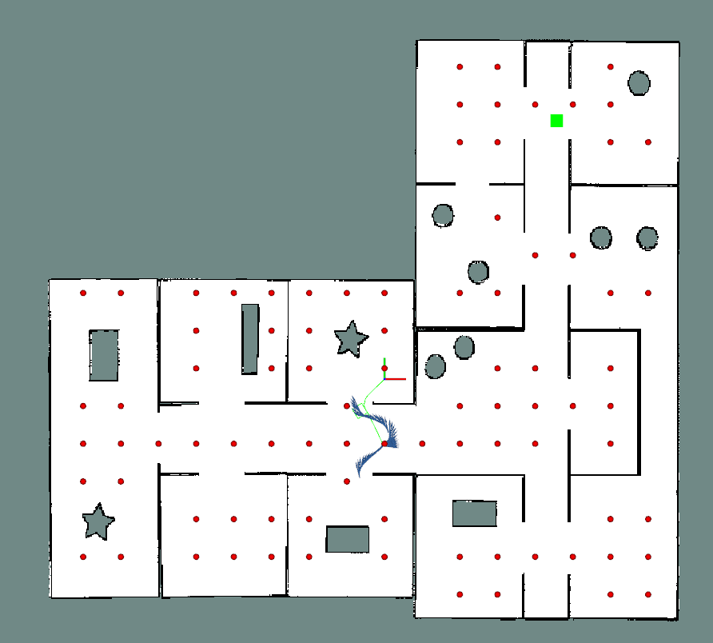

# Robot Explorer

ROS c++ package for erratic robot in stage simulator explorer a given map to find a hidden object. 

#### Stage Environment 
1. Green cube hidden object form the robt
2. Red rectangular cuboid is the robot




#### Allowed locations to visit in the given map


#### Map processed for a valid location to visit in RViz
1. Red dot points for the robot to look for the object
2. Green cube (hidden object form the robot)
3. Green square is the robot footprint
   



#### Run

```sh

$  cd catkin_ws/ && catkin build && roslaunch robot_explorer dev.launch 

```

To test for quick check place the object near the start point at -14 and -5 in the map

Modify [office_1.launch](launch/office_1.launch):


```xml
    <node name="target_check" pkg ="robot_explorer" type="target_check" output="screen" args="-14 -5"/>
    <!-- <node name="target_check" pkg ="robot_explorer" type="target_check" output="screen" args="8 15"/> -->
```
#### Demo Video

[](http://www.youtube.com/watch?v=AskgJKzURu4 "Robot Explore - Finding Hidden Object - RViz and Stage ROS Simulator")

